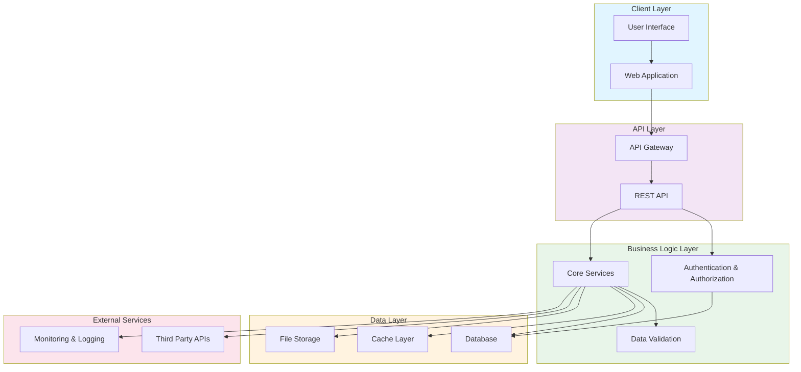

# Krimmalia Architecture Overview

## System Architecture

## Component Descriptions

### Client Layer
- **User Interface**: Frontend presentation and user interactions
- **Web Application**: Main web application entry point

### API Layer
- **API Gateway**: Entry point for all API requests, handles routing and rate limiting
- **REST API**: RESTful endpoints for client-server communication

### Business Logic Layer
- **Authentication & Authorization**: User identity verification and access control
- **Core Services**: Main business logic and operations
- **Data Validation**: Input validation and data integrity checks

### Data Layer
- **Database**: Primary data storage
- **Cache Layer**: Performance optimization through caching
- **File Storage**: Document and media file storage

### External Services
- **Third Party APIs**: Integration with external services
- **Monitoring & Logging**: System health monitoring and audit logs

## Data Flow

1. User requests flow through the Client Layer
2. Web Application routes requests to the API Gateway
3. API Gateway directs requests to appropriate REST endpoints
4. Business Logic Layer processes requests with authentication and validation
5. Data Layer handles persistence and caching
6. Responses flow back through the layers to the client

## Key Design Principles

- **Separation of Concerns**: Each layer has distinct responsibilities
- **Scalability**: Modular design allows for horizontal scaling
- **Security**: Authentication and validation at multiple levels
- **Performance**: Caching and optimized data access patterns
- **Monitoring**: Comprehensive logging and observability
